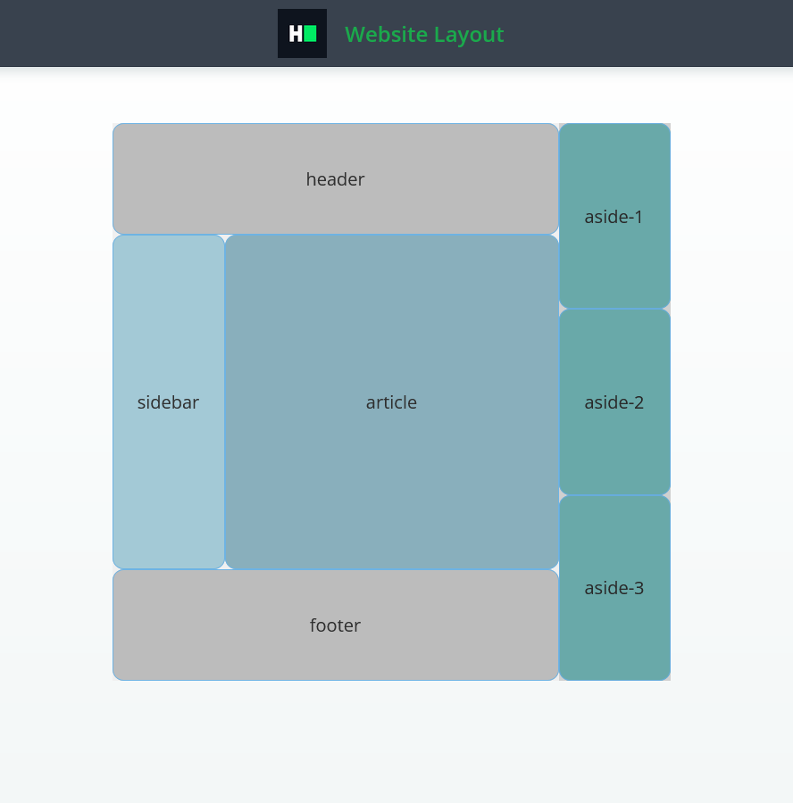

# CAPCO Technical Test

CSS: Flex Website Layout

Complete a website layout application with the following Ul components.

Demo:

left container

 - header
 - content
	 - sidebar
	 - article
 - footer

right container

 - aside block 1
 - aside block 2
 - aside block 3

----

Position all components as follows.

Use flex display to position elements.

Proportional sizes:

 - The left container takes 4/5 of the parent's width.
 - The right container takes 1/5 of the parent's width.
 - The sidebar takes 1/4 of the parent's width.
 - The article takes 3/4 of the parent's width.
 - The header takes 1/5 of the parent's height.
 - The footer takes 1/5 of the parent's height.

Every layout component should be located exactly how it is shown on the template 

The markup for the question is provided. Complete the src/css/style.css file to implement the required features.

Read-only files

 - test/*
 - src/index.js
 - src/index.html
 - src/css/readonly.css
 - app.js

