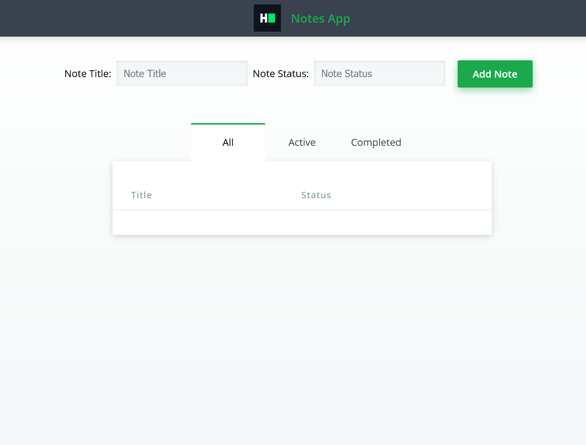

## CAPCO Technical Test

React: Notes App

You have an existing Notes App built with React that renders correctly but lacks functionality. Your task is to enhance the app by implementing the following features:

1. **Collect Data from Input Fields**:
   - Implement functionality to capture data entered into the note title and note status input fields.

2. **Render Notes in the Table**:
   - Implement logic to display the collected notes in the table.

3. **Filter Notes Based on Selected Tab**:
   - Implement functionality to filter the displayed notes based on the selected tab (All, Active, Completed).

Demo: 
  

### Steps to Implement

1. **Data Collection**:
   - Set up state variables to store the data entered into the note title and note status input fields.
   - Implement event handlers to capture changes in the input fields and update the corresponding state variables.

2. **Rendering Notes**:
   - Design the structure of the table to display the notes.
   - Use the state variables holding the note data to dynamically render rows in the table.

3. **Filtering Notes**:
   - Set up state variables to track the selected tab.
   - Implement logic to filter the displayed notes based on the selected tab.
   - Update the table to render only the filtered notes.

### Expected Outcome

Upon completion, the Notes App should allow users to enter note data, render the entered notes in the table, and filter the displayed notes based on the selected tab.

Read-only files

 - src/index.js
 - src/index.html
 - src/css/style.css
 - app.js

